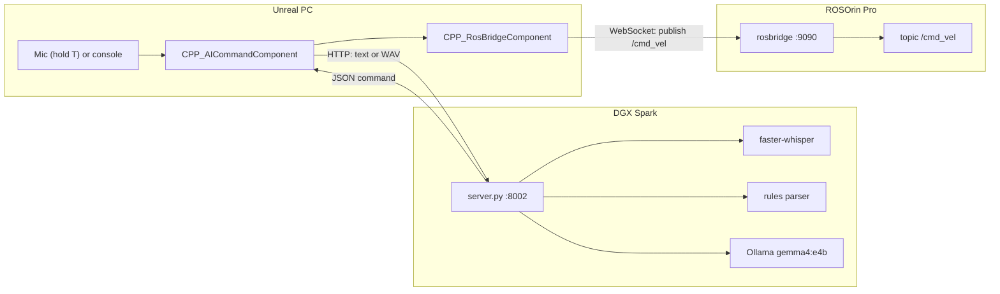

## Overview

Hold a key, say *"move forward for two seconds"* or *"turn left 90 degrees"*, and a Hiwonder ROSOrin Pro robot does it. Say *"stop"* and it stops. Speech recognition and language understanding run on an NVIDIA DGX Spark on the local network; Unreal Engine records the voice, sends it there, and drives the robot over rosbridge. Nothing goes to the cloud.

It applies the pattern from the [Digital Twin Platform](/work/digital-twin-platform)'s assistant to physical hardware: **the AI decides *what*, and the engine does it.**

## Architecture

## Fast path, smart path

Common commands — distances, durations, angles, "turn around", "slide left slowly" — are parsed by rules in milliseconds; about 0.4 s from releasing the key to the robot moving, most of it speech recognition. Anything the rules don't cover ("scoot up a tiny bit", "don't go forward") goes to a local LLM that is forced to answer in a strict JSON schema, at around 1.5 s.

## Safety first

A robot that mishears is a robot that drives into something, so safety is layered:

- **"stop" never waits for the AI** — it's answered in 3 ms even while a slow LLM request is running.
- Misheard or unknown commands stop the robot rather than guessing.
- An emergency-stop key works with no AI involved, and manual driving always overrides the AI.
- Stale answers are dropped, every move has a time limit, and the LLM can't invent a direction outside the schema.

## Testing

The server was tested end to end on the DGX Spark with synthetic speech (Piper TTS) packed exactly the way the Unreal code packs microphone audio: 64/64 parser tests pass, 40/40 randomized movement clips are understood correctly, and 80 randomized "stop"-type clips (stop, halt, wait, freeze, no…) produced **zero** movements.

<Callout title="Status">
The server side is built and tested end to end. The Unreal C++ was reviewed against the UE5 APIs but hasn't yet been compiled and run against the physical robot — the repository includes a first-run checklist for that step.
</Callout>
