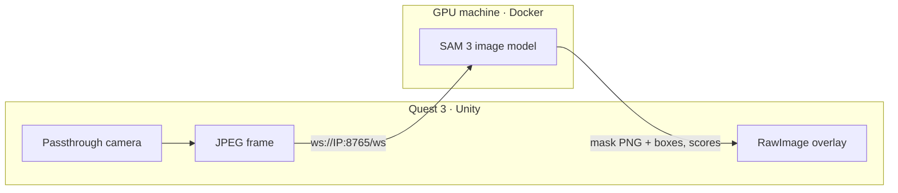

## Overview

Mixed reality gets much more useful when the headset understands what it's looking at. This project streams the **Meta Quest 3 passthrough camera** from a Unity app to Meta's **Segment Anything Model 3** running on a GPU machine on the local network, and draws the returned masks over the user's view. Ask for `"cup"` or `"keyboard"` and every matching object comes back with a mask, a bounding box and a confidence score.

## Pieces

- **Server** — SAM 3 (848M parameters) in a Docker container with GPU access, serving masks over WebSocket. A shared token guards it, because Docker-published ports bypass the host firewall and anyone on the network could otherwise use the GPU.
- **Unity client** — `QuestPassthroughCameraSource` requests headset-camera permission and feeds Meta's `PassthroughCameraAccess` texture to `Sam3StreamClient`, which sends frames, receives masks, composites them on a world-space canvas, and reconnects automatically.
- **Desktop test client** — streams a webcam or images to the server and reports per-frame round-trip latency and FPS, so the network path can be verified before involving the headset.

It's the networked companion to an offline SAM 3 study of image segmentation and video tracking.
